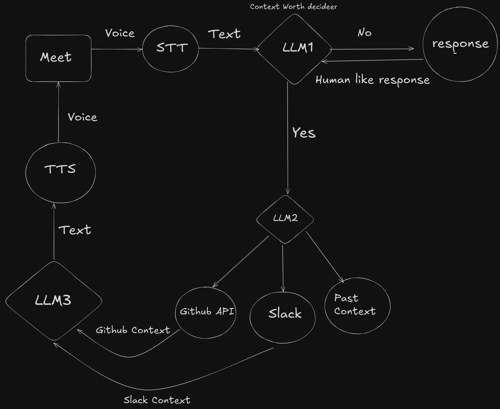

## What is Proxy?
Proxy is an intelligent meeting agent that attends routine meetings on your behalf. It leverages fast LLM inference (powered by Cerebras) to provide human-like responses in real-time, handling status updates, standard check-ins, and informational queries while you focus on work that actually matters.

## My motivation behind this:
- The motivation behind this idea was the boring meetings on updates and scrum meetings which do not require your attention 
- If you hate **"FORCED-FUN"** (silly team bonding meetings) then Proxy should be able to do this too (Future Scope)
- Fast token generation of **Cerebras**. It would be nearly impossible to mimic human like answers if the llm's where slow

## Solution
- The AI is your Co-Pilot: It handles the routine, informational tasks. It responds to standard checks, pulls up data instantly, and communicates status reports. This is the "What did you do yesterday? What's the PR number for that fix?" part of the meeting (this also includes laughing at the jokes(lame or !lame) of your co workers)
- You are the Lead Pilot: You handle the complex, hands-on, and visual maneuvers that require judgment and direct control. This is the screen-sharing demo, the deep technical discussion, and the strategic planning.

## The overview of system 

## How to start
### 1. Clone the repo
> git clone https://github.com/adityav477/P-roxy
  cd P-roxy

### 2. Get the API keys mentioned in stt/.env.example

### 3. Start the webhook.js
> cd stt
> node webhook.js

### 4. You would need ngrok or other similar service that will make your localhost:8000 public 
> ngrok http 8000

 you need ngrok so that the recall.ai can send transcripts to your local webhook running 8000
 refer this-> [AsseblyAI+ recall.ai implementation](https://www.assemblyai.com/docs/integrations/recall)

### 4. Start meetings.js in another terminal
> node meetings.js 

### 5. Start the google meet and paste the meeting url in the meetings.js terminal
 the transcript will not reflect immediately so please wait for few seconds

### 6. To stop type STOP that will stop the meeting and make your bot leave in the meetings.js terminal
> [BOT] Check Terminal 2 for real-time transcripts
  Type "STOP" to end transcription:
## Tech Stack 

 ### LLM1:
- decides if the questions needs the context from the Github and Slack or from the past responses
- if no then the llm1 gives the human like response

### LLM2:
- the llm 2 is specifically for designing the query search for the Github API because vector search is not possible 
traditional rag can take too much time and decided to utilize the githubs inbuilt search
- comparatively quite smaller reasoning model

### TTS and STT:
- TTS - used ElevenLabs
- STT - used Assembly along with Recall.ai

## For Meeting Bots:
- used Recall.ai webhook + Assembly AI to get transcripts using webhooks [webhook.js](stt/webhook.js)
- and for sending voice to meetings also used Recall.ai /output_audio endpoint [tts.js](tts/tts.js)

## Features that will be good:
- Same voice that tough real time is tough (Must to fool your co workers)
- maybe we could also do chat injestion instead of necessary voice (but implementing voice > implementing text)
- the key lies in the prompts of the llm's
- making human intervention possible
- using Avatar of the user too give a more realistic feel

## Note & Problems:
- selection of prompts and models will be decided based on trial and error 
- currently because of poor prompting sometimes the **Github** url and query are not that great
but can be optimized with fine tuning wrt github api docs
- Recall .ai is sometimes lags in sending voice to webhooks

### Demo:
[Demo Video](https://www.youtube.com/watch?v=d-jtwYeNT9A)

